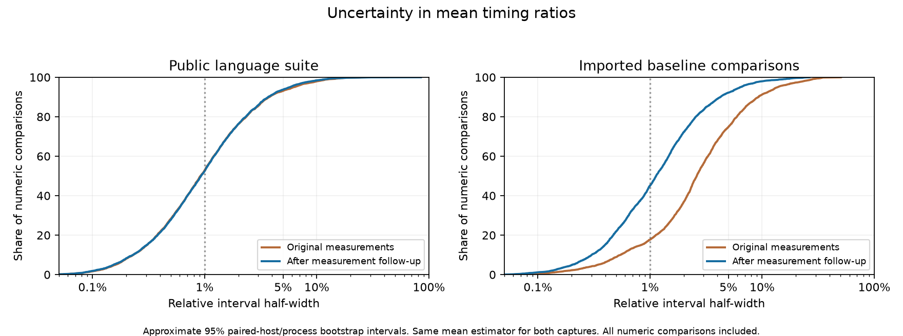
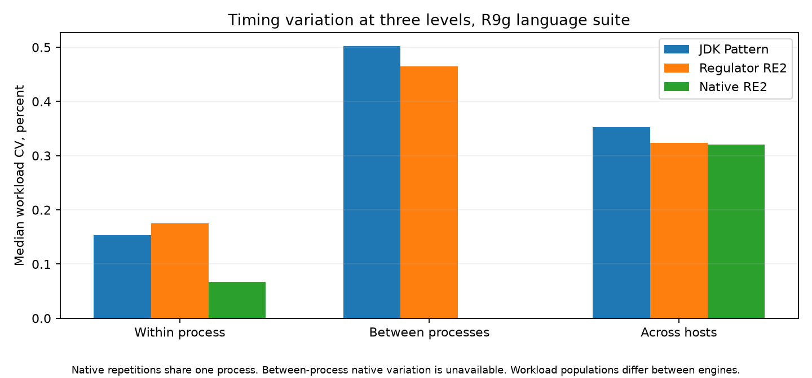
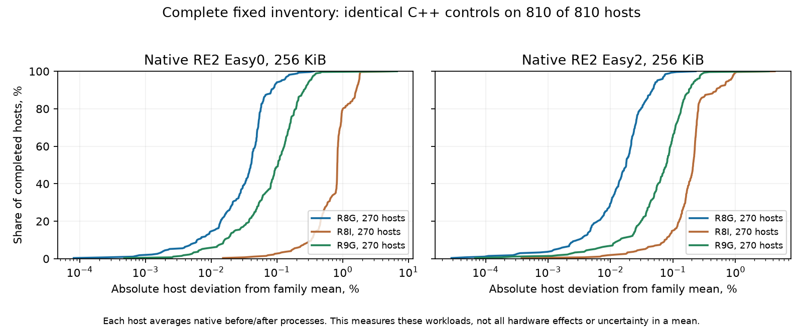
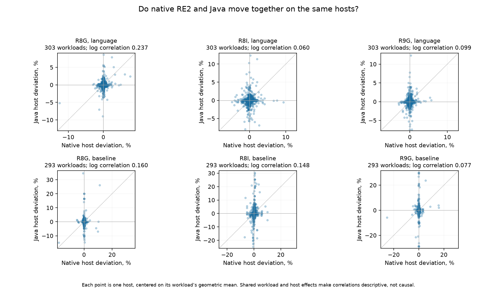

# Regulator 1.0 measurement quality

This assessment distinguishes measurement defects from execution variability.
The measured library remains the published `io.airlift:regulator:1.0` artifact.
The follow-up changes collectors, aggregation, and reporting, not the engine.

## What needed repair

The original campaign completed its scheduled jobs and correctness checks.
That did not establish that every timing window was long enough. Its internal
warning ledger combined several different concerns, including timing variation,
performance objectives, and allocation objectives. The count of flagged rows
was not a count of invalid comparisons.

Reconstructing all 9,288 numeric comparisons in the complete campaign capture
exposed two distinct timing problems. Some short measured windows included
large transitions. Other cases
were stable within a JVM but differed substantially between fresh JVMs. Native
RE2 controls were usually much steadier, so a common machine-speed factor did
not explain most Java outliers. A few large native workloads also varied, so a
small native control cannot stand in for every memory access pattern.

The follow-up separates allocation profiling from primary timing, uses
independent per-case forks, and lengthens warmup and measured windows where
prospective controls require it. Every valid host and process within a declared
measurement cohort remains included. When a collector or allocation changes,
the affected cohort is
superseded uniformly and preserved separately. Infrastructure failures are
retried; unfavorable timings do not justify removing individual hosts or forks.

The first replacement expansion exposed an inherited short-smoke calibration
gate that rejected hosts before formal measurement. That complete baseline
cohort was retained as diagnostic evidence and superseded uniformly. The
corrected preparation checks semantics, release identity and every required
route without a short timing gate. Formal timing still uses the prospectively
qualified protocol and resource checks. An audit of the original final
baseline archive found no recorded calibration-drift rejection; its single
benchmark failure was in a Trino shard already selected for replacement.

The final scope audit also found that the temporal-drift selection had omitted
the original 256 KiB easy2 DFA process-state problem. Its within-process timing
was stable, so it did not pass that selection criterion. The isolated pilot
and factorial CPU controls nevertheless gave much steadier measurements.
The correction measured that exact operation on all three CPU
families and both access modes, using the qualified retained-workload protocol.
Its accompanying easy2 control is superseded as a complete nine-host cohort.
A temporal screen alone is not a sufficient inventory of measurement defects.
The corrected native-access DFA ratios are 0.978 on R8g, 1.705 on R8i and
0.829 on R9g. This makes the Intel comparison worse and the R9g comparison
better. Both remain in the report. Stable but different fork states remain
visible in the Intel pure-Java samples and contribute to their interval.

The earlier R9g factorial control measured this exact DFA operation near
126 microseconds with G1 and CPU 0, and 69 microseconds with G1 and CPUs 0
and 1. Fixing `ActiveProcessorCount=1` preserved that difference. Compiler
logs show different generated-code shapes between those settings. The CPU
allowance applies to the whole JVM, including compiler and GC threads; it is
not a claim that the regex itself needs two execution threads. These controls
identify sensitivity to collection settings, but do not prove the cause of
every fast or slow JVM in the original batch.

## What the numbers mean

Each final numeric comparison estimates mean operation cost. The reducer
averages measured iterations within each process, process means within each
host, and host means equally. The reported ratio divides the candidate's mean
cost by the comparator's mean cost. This includes recurring expensive work that
an iteration median can conceal. The original median estimates and raw evidence
remain available.

The report shows approximate 95% intervals for the ratio and absolute costs.
It resamples paired hosts together and whole independent processes within each
host. Individual iterations are not independent host samples. Native repetitions
from one process stay together. The calculation uses 4,000 deterministic draws
and is independently reproducible from the archived normalized inputs.

An interval containing 1 means the data do not establish which engine is
faster. It does not establish equivalence. A well-measured one-percent difference
can have a clear direction; a large uncertain point estimate does not receive
an automatic winner label. No universal five-percent tolerance determines a win.

Three or four hosts provide limited coverage of possible machine and compiler
states. The intervals describe observed sampling variation, not a guarantee
that every future run falls inside them. Process ranges and coefficients of
variation describe execution variability separately from uncertainty in the
estimated mean.

Replicas use distinct EC2 instance lifetimes. Physical-host placement and shared
environmental effects are not controlled. Two concurrent R9g bit-state replicas
show strongly correlated long timing blocks despite different raw samples.
This does not establish physical co-location or a cause, but it means that
separate instances alone cannot guarantee independent environmental noise.
The approximate intervals do not account for every possible shared effect.

## Where variation occurs

Variation is not exclusively between machines. On R9g, the complete language
collection has the following median coefficients of variation across workloads.
Regulator uses native access here; comparator observations shared by the two
access modes are counted once.

| Engine | Workloads | Within a process | Between fresh processes | Across host means |
| --- | ---: | ---: | ---: | ---: |
| Regulator RE2 frontend | 303 | 0.17% | 0.47% | 0.32% |
| Native RE2 | 303 | 0.07% | not sampled | 0.32% |
| Regulator Java frontend | 290 | 0.20% | 0.53% | 0.37% |
| JDK Pattern | 290 | 0.15% | 0.50% | 0.35% |
| Regulator Trino frontend | 287 | 0.48% | 0.66% | 0.39% |
| Joni | 287 | 0.56% | 0.41% | 0.34% |

These are descriptive variation measures, not confidence intervals. Native RE2
uses one process per language observation, so that dataset does not independently
sample its between-process variation. The full distributions, including the
less stable tail, appear in the figures and report details.

Noisy workloads tend to remain noisy across process and host levels. Across
R9g language workloads, the rank correlation between fresh-process variation
and host-mean variation is 0.65 to 0.74 for the Regulator frontends, 0.70 for
JDK Pattern and 0.69 for Joni. Correlation between within-process variation and
host-mean variation is weaker, 0.48 to 0.55 for Regulator, 0.34 for JDK Pattern,
0.50 for Joni and 0.23 for native RE2. This is consistent with workload-specific
sensitivity. It does not identify a cause, and host means already average
process samples, so the levels are not independent.

## Native controls

Native RE2 measures the same requested operation on the same host where the
comparison supports it. Its absolute timing, before/after drift, and CPU versus
elapsed time help distinguish shared machine behavior from Java-specific
variation. Native code also has process state, allocation and cache behavior. These
controls do not isolate pure hardware noise or provide a noise value that can
simply be subtracted from Java timings. Different algorithms and memory access patterns can respond
differently to the same hardware.

Host correlations center log timings within each workload and CPU family.
This avoids mistaking naturally slow workloads for slow hosts. Shared workloads
and hosts make these correlations descriptive; they are not independent-sample
significance tests. JDK Pattern and Joni-only comparisons do not have a matched
native control for the same requested operation.

## Scope

The public report and download contain the frozen 5,004-row publication
inventory. The private complete capture contains 9,462 rows used during the
quality analysis. The archived broader evidence also contains custom Rebar
measurements, retained-memory tables, compiler diagnostics, concurrency, and
capacity evidence. Those are different measurement formats and purposes.

The broad uncertainty analysis covers numeric comparisons in the complete
captured campaign. Public pages calculate their summaries and timing markers
only from publication rows. The analysis does not turn every historical
baseline table into a newly qualified timing result.
Original Rebar exports retain aggregate mean, standard deviation, minimum, and
maximum values, without ordered raw iteration arrays. Their original five-second
warmup and measured windows remain historical evidence. No synthetic samples
were constructed from those summaries.

The final results document records completed follow-up coverage, precision,
remaining execution variability, source identities, and cost. The analysis
utility in `benchmark-report/analysis` reproduces every public numeric estimate
and interval from the archived inputs, and supports audit of the larger captured
campaign.

The public UI places `*` on an actual Regulator or comparator timing only when
that timing's approximate 95% interval half-width exceeds 5% of its mean. It
does not mark rows merely because a separate diagnostic found multiple stable
states or a repeatability concern. Publishing only those cases would be a
post-hoc selection; the diagnostic evidence and its interpretation stay here
and in the private archive.

## Extended-window checks

Fixed three-host controls tested suspicious late changes without replacing
individual hosts or choosing favorable windows. The checks retained all primary
forks and used separate instrumented executions for compiler and GC evidence.

| Exact diagnostic | Full-window paired ratio change versus first 20 measured seconds |
| --- | ---: |
| R8g no-match replacement, both access modes | -0.052% to -0.108% |
| R8i Java-pattern compilation, both access modes | +0.059% to +0.086% |
| R8g internal split capture | -0.066% |
| R8g matching replacements, three cases | +0.505% to +0.652% |
| R9g matching replacements, three cases | -0.634% to +1.500% |
| R9g literal callback replacement, both access modes | -0.009% to -0.023% |
| R9g 32 KiB no-match plain replacement, both access modes | -1.233% to -2.250% |
| R9g 32 KiB no-match callback replacement, both access modes | -0.704% to -1.698% |

The R9g 1 KiB capture replacement retains a 1.500% change when its measured
window grows from 20 to 80 seconds. The complete extended result is 0.656%
higher than the corresponding formal ratio. Its ordered forks do not share a
continuing rise: one host contributes the largest transition, another rises
slightly then falls, and the third returns toward its initial level. Relevant
compilation finishes before the 20-second warmup ends in the separate profiles.
That evidence supports retaining the complete formal observations, but does
not establish sub-percent precision or prove the remaining variation unavoidable.

The callback control also shows why window stability and repeatability are
different questions. Its extended-window ratio is about 5% lower than the
earlier formal cohort in both access modes, despite nearly zero sensitivity
to the window length within the new cohort. The native-access ratios are
0.668 and 0.635. Their approximate intervals do not overlap. Recorded JVM
settings, benchmark inputs, allocation and warmup agree; the experiment does
not isolate the cause of the difference. Longer measurement alone does not
remove this between-run variation. Both cohorts establish the same performance
direction, but they do not support a one-percent repeatability claim. The
formal cohort remains intact, and the faster diagnostic cohort remains
separate. Intervals based on three observed hosts cannot capture every source
of variation between campaigns.

The final R9g no-match controls show a larger repeatability limitation. The
independent cohort has 14.5% to 26.7% lower ratios than the formal cohort across
plain and callback replacement in both access modes. Each pair of approximate
intervals is disjoint. Generated benchmark bytecode, parameters, released JAR,
JDK, JVM flags, CPU allowance, allocation and warmup agree; measured duration
and fork count differ. Extending the window accounts for only 0.7% to 2.3%
within the diagnostic cohort. The traces contain opposing host movements and
recurring excursions, without a common continuing startup transition. All
relevant compilation in the separate profiles finishes by 4.55 seconds.

This establishes a between-cohort precision limit, not its cause or inevitability.
The four formal no-match comparisons remain intact, and the faster diagnostics
remain separate. This assessment records the repeatability difference for
those rows and the two literal-callback rows; the private archive preserves
both cohorts. These fixed-input operations are excluded from headline
summaries. Both cohorts agree on the performance direction, but neither the
narrow diagnostic intervals nor the original intervals bound future repetition.
A fresh campaign targeting precise costs for these allocating cases should
sample hosts across collection periods and availability zones, with matched
memory-sensitive controls. Simply extending all timings or choosing the faster
cohort is not an established repair.

These are sensitivity checks, not confidence intervals. Their conclusions
apply to the recorded operations, CPU families, access modes and allocations.
They do not establish that every workload is stable to the same percentage.
No later window substitutes for a complete formal measurement.

## Next campaign

Freeze the statistical question and pilot before launching the full inventory.
For this report that question is average operation cost, including recurring
allocation and collection work. A median of short intervals answers a different
question and can conceal that cost.

- Run independent per-case processes, with allocation and compiler profiling in
  separate passes. Record GC selection, processor count, CPU affinity, heap,
  published artifact, comparators, and exact input bytes.
- Qualify representative allocating, compiler-sensitive, and large-memory cases
  on every CPU family. Check ordered traces and aggregate estimator sensitivity,
  including absolute shifts that signed averages can conceal.
- Assess independent-process and host precision directly. Adding iterations to
  one stable JVM cannot sample a different compiled state on another JVM.
- Spread replicas across availability zones and collection periods, and retain
  their timestamps. Inspect common timing movements before treating separate
  instances as independent samples of environmental conditions.
- Use matched native workloads as controls, alongside stable small controls.
  Include CPU topology and memory-sensitive operations in instance-size checks.
- Stagger provisioning and use the existing shared transfer-bucket support with
  separate job prefixes. Avoid creating hundreds of transfer buckets at once.
  Stage immutable source archives once when transport tooling supports reuse.
- Keep complete failed attempts, verify recovery during collection, and track
  cloud instance lifetimes separately from local controller preparation time.
- Reconcile completion against the full frozen inventory when resuming a queue.
  Jobs still active at resume selection can fail afterward; before retiring their
  controller, assign every unfinished job to exactly one live queue. Track the
  remaining work by runtime and allocated vCPUs, not job count alone.

The final report's archived inputs reproduce its statistics without new cloud
measurements. A fresh campaign must budget for the qualified timing protocol;
the original short-protocol campaign's roughly 2,000 hours does not by itself
price a fresh run using all follow-up protocols. The results document separates
the original cost, additional diagnostic and replacement cost, and the limits
of any next-run estimate.
